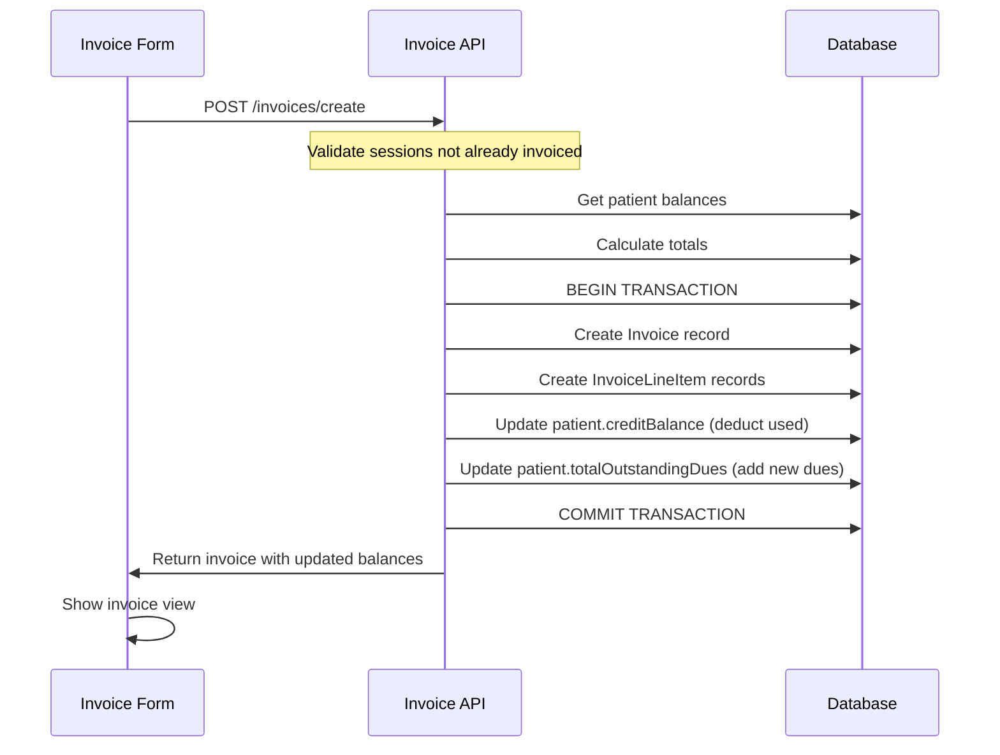
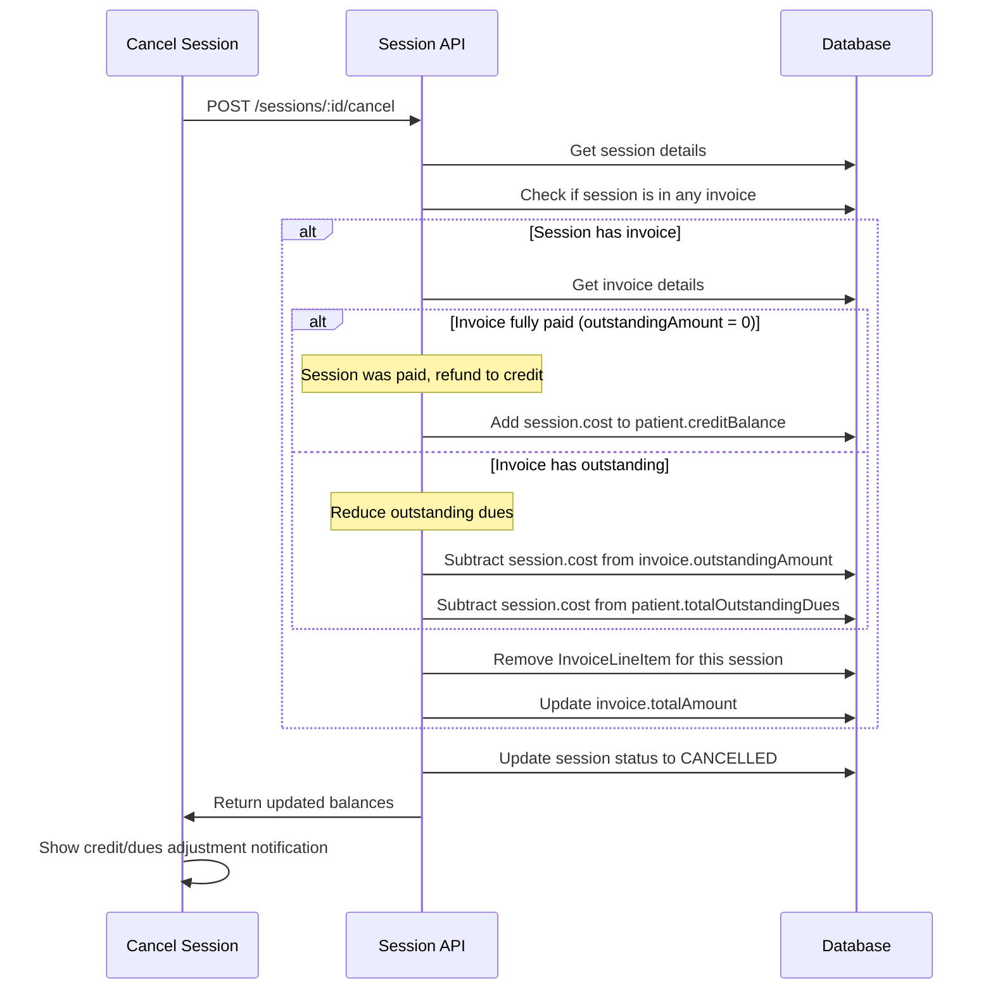
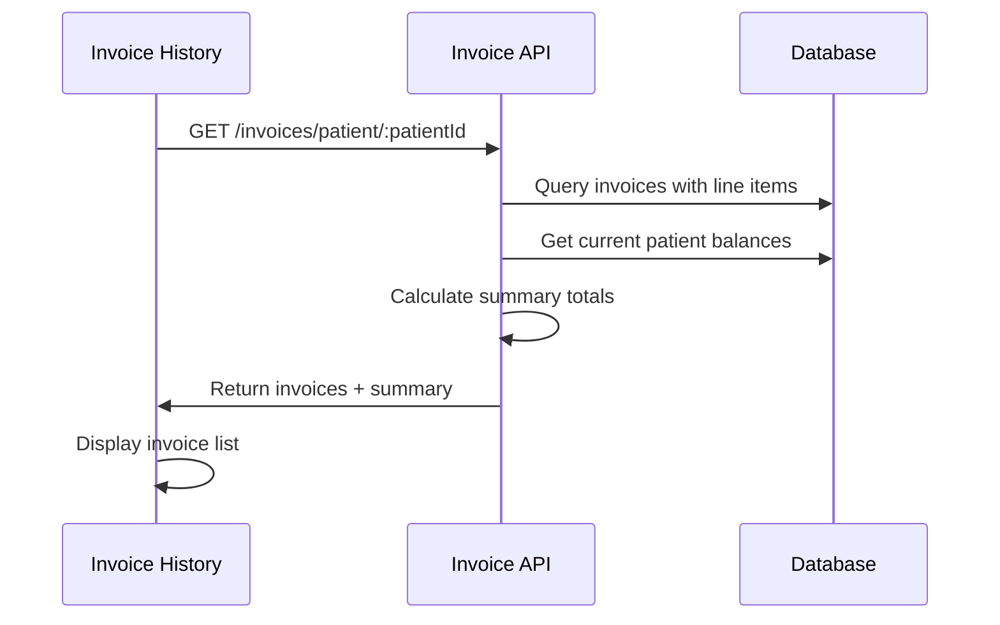

# Payment Management System - Design

## Overview

The payment management system uses an **invoice-based architecture** where payments are tracked as invoices rather than per-session. The system maintains patient-level financial balances (credit and outstanding dues) that are adjusted with each payment and cancellation. This approach simplifies payment tracking and provides a clear audit trail through invoices.

## Core Concepts

### Invoice-Based Payment Model
- **No per-session payment status** - Sessions don't track individual payment states
- **Patient-level financial tracking** - All amounts tracked at patient level via `creditBalance` and `totalOutstandingDues`
- **Invoice as payment record** - Each payment creates an invoice that references the sessions being paid for
- **Dynamic balance calculation** - Credit/due balances automatically adjust with payments and cancellations

### Example Scenario
1. Patient books 5 sessions @ ৳1000 each = ৳5000 total
2. Patient pays ৳3000 → Creates invoice, ৳2000 goes to `totalOutstandingDues`
3. Patient cancels 1 session → ৳1000 added to `creditBalance`, `totalOutstandingDues` becomes ৳1000
4. Next booking considers existing balances: If 3 new sessions @ ৳1000 = ৳3000, but with ৳1000 credit and ৳1000 due, net payable = ৳3000

## Architecture

### Data Model Changes

#### Remove from Session Table
- ~~`paymentStatus`~~ - No longer needed
- ~~`paidWithCredit`~~ - Tracked at invoice level instead

#### New Invoice Table
- `id`: UUID (primary key)
- `tenantId`: UUID (foreign key)
- `patientId`: UUID (foreign key)
- `invoiceNumber`: String (auto-generated, e.g., "INV-2024-001")
- `invoiceDate`: DateTime
- `totalAmount`: Decimal (sum of all line items)
- `paidAmount`: Decimal (actual amount paid)
- `creditUsed`: Decimal (credit applied to this invoice)
- `outstandingAmount`: Decimal (totalAmount - paidAmount - creditUsed)
- `paymentMethod`: CASH | CARD | BANK_TRANSFER
- `notes`: String (optional)
- `confirmedBy`: UUID (foreign key to User)
- `createdAt`: DateTime
- `updatedAt`: DateTime

#### New InvoiceLineItem Table
- `id`: UUID (primary key)
- `invoiceId`: UUID (foreign key)
- `sessionId`: UUID (foreign key)
- `description`: String (e.g., "Speech Therapy - Jan 15, 2024")
- `amount`: Decimal (session cost)
- `createdAt`: DateTime

#### Remove SessionPayment Table
- No longer needed - replaced by Invoice system

#### Patient Table (existing fields)
- `creditBalance`: Decimal - Money available for future bookings
- `totalOutstandingDues`: Decimal - Total unpaid amount across all invoices

### Database Schema (Prisma)

```prisma
model Invoice {
  id                String            @id @default(uuid())
  tenantId          String
  patientId         String
  invoiceNumber     String            @unique
  invoiceDate       DateTime          @default(now())
  totalAmount       Decimal           @db.Decimal(10, 2)
  paidAmount        Decimal           @db.Decimal(10, 2)
  creditUsed        Decimal           @default(0) @db.Decimal(10, 2)
  outstandingAmount Decimal           @db.Decimal(10, 2)
  paymentMethod     PaymentMethod
  notes             String?
  confirmedBy       String
  createdAt         DateTime          @default(now())
  updatedAt         DateTime          @updatedAt
  
  Patient           Patient           @relation(fields: [patientId], references: [id])
  Tenant            Tenant            @relation(fields: [tenantId], references: [id])
  User              User              @relation(fields: [confirmedBy], references: [id])
  InvoiceLineItem   InvoiceLineItem[]
  
  @@index([tenantId, patientId])
  @@index([tenantId, invoiceDate])
  @@index([invoiceNumber])
}

model InvoiceLineItem {
  id          String   @id @default(uuid())
  invoiceId   String
  sessionId   String   @unique // Each session can only be in one invoice
  description String
  amount      Decimal  @db.Decimal(10, 2)
  createdAt   DateTime @default(now())
  
  Invoice     Invoice  @relation(fields: [invoiceId], references: [id], onDelete: Cascade)
  Session     Session  @relation(fields: [sessionId], references: [id])
  
  @@index([invoiceId])
  @@index([sessionId])
}

// Update Session model - remove paymentStatus, add invoice relation
model Session {
  // ... existing fields ...
  InvoiceLineItem InvoiceLineItem? // Optional - null if not yet invoiced
}

// Remove SessionPayment model entirely
```

### Migration Strategy

1. **Create new tables**
   - Create `Invoice` table
   - Create `InvoiceLineItem` table

2. **Migrate existing data** (if any SessionPayment records exist)
   - Group SessionPayment records by patient and date
   - Create Invoice records from grouped payments
   - Create InvoiceLineItem records linking to sessions
   - Verify patient balance consistency

3. **Remove old tables**
   - Drop `SessionPayment` table
   - Remove `paymentStatus` from `Session` table
   - Remove `paidWithCredit` from `Session` table

4. **Update indexes**
   - Add indexes for invoice queries
   - Remove session payment status indexes

### Component Structure

```
frontend/
├── app/
│   └── payments/
│       ├── page.tsx (Payment dashboard - patients with unpaid sessions)
│       └── invoices/
│           └── [invoiceId]/
│               └── page.tsx (Invoice detail/print view)
├── components/
│   └── payments/
│       ├── payment-form.tsx (Invoice creation form)
│       ├── invoice-view.tsx (Invoice display/print component)
│       ├── unpaid-sessions-list.tsx (Sessions without invoices)
│       └── invoice-history.tsx (Patient invoice history)
└── hooks/
    └── use-payments.ts (Payment/Invoice API hooks)

backend/
└── src/
    └── modules/
        ├── payments/
        │   ├── payments.controller.ts
        │   ├── payments.service.ts
        │   ├── payments.routes.ts
        │   └── payments.schema.ts
        └── invoices/
            ├── invoices.controller.ts
            ├── invoices.service.ts
            ├── invoices.routes.ts
            └── invoices.schema.ts
```

## Components and Interfaces

### 1. Payment Dashboard (`/payments`)
**Purpose:** Central hub for managing patient payments

**Features:**
- Display all patients with unpaid sessions (sessions without invoices)
- Show patient financial summary:
  - Total cost of unpaid sessions
  - Current credit balance
  - Current outstanding dues
  - Net payable amount (sessions - credit + dues)
- Quick access to create invoice
- Filter by date range, patient, therapist
- Search by patient name

### 2. Invoice Creation Form Component
**Props:**
- `patientId`: string
- `unpaidSessions`: Session[]
- `onSuccess`: (invoice: Invoice) => void

**Features:**
- Session selection (multi-select with checkboxes)
- Display selected sessions total
- Show patient's current balances:
  - Credit balance available
  - Outstanding dues
- Payment input:
  - Amount paid (editable)
  - Payment method (CASH/CARD/BANK_TRANSFER)
  - Credit to apply (auto-calculated, editable up to available credit)
  - Notes field
- Real-time calculation display:
  - Total bill for selected sessions
  - Credit applied
  - Amount paid
  - New outstanding dues (if any)
  - Remaining credit (if any)
- Validation:
  - Paid amount must be >= 0
  - Credit used cannot exceed available credit
  - Credit used cannot exceed total bill

### 3. Invoice View Component
**Props:**
- `invoiceId`: string

**Features:**
- Invoice header:
  - Invoice number (e.g., INV-2024-001)
  - Invoice date
  - Patient information
- Line items table:
  - Session date and time
  - Therapy type
  - Therapist name
  - Amount
- Financial summary:
  - Subtotal (sum of line items)
  - Credit applied
  - Amount paid
  - Outstanding amount
  - Payment method
- Patient balance snapshot (at time of invoice):
  - Credit balance after this invoice
  - Outstanding dues after this invoice
- Actions:
  - Print invoice
  - Download as PDF
  - Email to patient (future)
- Notes section

### 4. Invoice History Component
**Props:**
- `patientId`: string

**Features:**
- List all invoices for patient
- Display per invoice:
  - Invoice number and date
  - Total amount
  - Paid amount
  - Outstanding amount
  - Payment method
- Click to view full invoice
- Filter by date range
- Summary totals:
  - Total invoiced
  - Total paid
  - Total outstanding

## Data Flow

### Invoice Creation Flow



### Financial Balance Calculation

```typescript
// When creating invoice for sessions
totalBill = sum(selectedSessions.cost)
creditToApply = min(patient.creditBalance, totalBill)
amountPaid = userInputAmount
outstandingAmount = totalBill - creditToApply - amountPaid

// Update patient balances
newCreditBalance = patient.creditBalance - creditToApply
newOutstandingDues = patient.totalOutstandingDues + outstandingAmount

// For next booking
nextBookingTotal = sum(newSessions.cost)
netPayable = nextBookingTotal - newCreditBalance + newOutstandingDues
```

### Session Cancellation Flow



### Payment History Query Flow



## API Endpoints

### Invoice Endpoints

#### GET /api/v1/invoices/unpaid-sessions
Get all sessions without invoices, grouped by patient
```typescript
Response: {
  patients: [{
    patient: {
      id: string,
      firstName: string,
      lastName: string,
      creditBalance: number,
      totalOutstandingDues: number
    },
    sessions: Session[],
    totalCost: number,
    netPayable: number // totalCost - creditBalance + totalOutstandingDues
  }],
  summary: {
    totalPatients: number,
    totalSessions: number,
    totalCost: number
  }
}
```

#### POST /api/v1/invoices/create
Create invoice for selected sessions
```typescript
Request: {
  patientId: string,
  sessionIds: string[], // Sessions to include in invoice
  paidAmount: number, // Actual cash/card payment
  paymentMethod: 'CASH' | 'CARD' | 'BANK_TRANSFER',
  creditUsed: number, // Credit to apply (auto-calculated but can be adjusted)
  notes?: string
}

Response: {
  invoice: {
    id: string,
    invoiceNumber: string,
    invoiceDate: string,
    totalAmount: number,
    paidAmount: number,
    creditUsed: number,
    outstandingAmount: number,
    paymentMethod: string,
    lineItems: [{
      sessionId: string,
      description: string,
      amount: number
    }]
  },
  patient: {
    id: string,
    name: string,
    creditBalance: number, // Updated balance
    totalOutstandingDues: number // Updated dues
  }
}
```

#### GET /api/v1/invoices/:invoiceId
Get invoice details
```typescript
Response: {
  invoice: Invoice,
  lineItems: InvoiceLineItem[],
  patient: Patient,
  confirmedBy: User
}
```

#### GET /api/v1/invoices/patient/:patientId
Get all invoices for a patient
```typescript
Query params: {
  page?: number,
  limit?: number,
  startDate?: string,
  endDate?: string
}

Response: {
  invoices: Invoice[],
  summary: {
    totalInvoiced: number,
    totalPaid: number,
    totalCreditUsed: number,
    totalOutstanding: number
  },
  pagination: {
    page: number,
    limit: number,
    total: number,
    totalPages: number
  }
}
```

#### GET /api/v1/invoices/patient/:patientId/balance
Get current patient financial balance
```typescript
Response: {
  patient: {
    id: string,
    name: string,
    creditBalance: number,
    totalOutstandingDues: number
  },
  unpaidSessionsCount: number,
  unpaidSessionsTotal: number,
  netPayableForUnpaid: number
}
```

## Business Rules

### Invoice Creation Rules
1. **Session Validation**
   - Sessions must belong to the specified patient
   - Sessions must not already be in another invoice
   - Sessions must not be cancelled

2. **Financial Validation**
   - `paidAmount` must be >= 0
   - `creditUsed` cannot exceed patient's `creditBalance`
   - `creditUsed` cannot exceed invoice `totalAmount`
   - `creditUsed` must be >= 0

3. **Balance Updates**
   - `patient.creditBalance` -= `creditUsed`
   - `patient.totalOutstandingDues` += `outstandingAmount`
   - Where: `outstandingAmount = totalAmount - paidAmount - creditUsed`

### Session Cancellation Rules
1. **Check Invoice Status**
   - If session not in any invoice: No financial adjustment needed
   - If session in invoice: Adjust based on invoice payment status

2. **Fully Paid Invoice** (outstandingAmount = 0)
   - Add `session.cost` to `patient.creditBalance`
   - Subtract `session.cost` from `invoice.totalAmount`
   - Remove invoice line item

3. **Invoice with Outstanding** (outstandingAmount > 0)
   - Subtract `session.cost` from `invoice.outstandingAmount`
   - Subtract `session.cost` from `invoice.totalAmount`
   - Subtract `session.cost` from `patient.totalOutstandingDues`
   - Remove invoice line item

4. **Empty Invoice Handling**
   - If all line items removed, mark invoice as void/cancelled

### Net Payable Calculation
For any new booking or payment:
```typescript
netPayable = sessionsCost - creditBalance + totalOutstandingDues
```

Example:
- 3 new sessions @ ৳1000 = ৳3000
- Patient has ৳500 credit
- Patient has ৳1000 outstanding dues
- Net payable = ৳3000 - ৳500 + ৳1000 = ৳3500

## Error Handling

### Invoice Validation Errors
- `SESSION_ALREADY_INVOICED` - Session is already in another invoice
- `INVALID_CREDIT_AMOUNT` - Credit used exceeds available balance
- `INVALID_PAYMENT_AMOUNT` - Paid amount is negative
- `SESSION_NOT_FOUND` - One or more sessions don't exist
- `SESSION_CANCELLED` - Cannot invoice cancelled sessions
- `PATIENT_MISMATCH` - Sessions don't belong to specified patient

### Cancellation Errors
- `INVOICE_NOT_FOUND` - Session's invoice doesn't exist
- `CANNOT_CANCEL_INVOICED` - Session is in a locked/finalized invoice (future feature)

### Error Response Format
```typescript
{
  success: false,
  error: {
    code: ErrorCode,
    message: string,
    details?: any
  }
}
```

## Testing Strategy

### Unit Tests
- Invoice total calculation
- Credit application logic
- Outstanding dues calculation
- Net payable calculation
- Balance update logic
- Cancellation refund/adjustment logic
- Invoice number generation

### Integration Tests
- Complete invoice creation flow
- Session cancellation with financial adjustments
- Multiple invoices for same patient
- Credit exhaustion scenarios
- Outstanding dues accumulation
- Concurrent invoice creation prevention

### Edge Cases to Test
1. **Zero Payment Invoice**
   - Patient has enough credit to cover all sessions
   - paidAmount = 0, creditUsed = totalAmount

2. **Partial Payment**
   - paidAmount + creditUsed < totalAmount
   - Verify outstanding dues added correctly

3. **Overpayment Prevention**
   - Ensure creditUsed cannot exceed available credit
   - Ensure creditUsed cannot exceed totalAmount

4. **Cancellation Scenarios**
   - Cancel session from fully paid invoice → Credit added
   - Cancel session from invoice with outstanding → Dues reduced
   - Cancel last session in invoice → Invoice becomes empty

5. **Balance Consistency**
   - After any operation, verify:
     - creditBalance >= 0
     - totalOutstandingDues >= 0
     - Sum of all invoice outstandingAmounts = patient.totalOutstandingDues

### UI Tests
- Invoice form validation
- Real-time calculation updates
- Invoice view/print formatting
- Invoice history pagination
- Balance display accuracy
- Cancellation notification display
