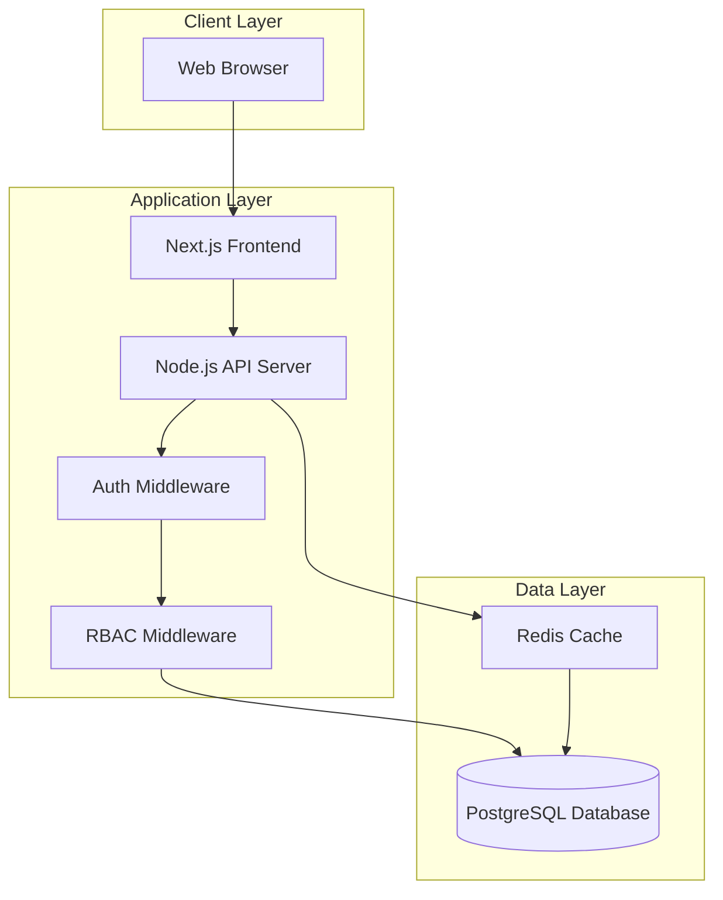
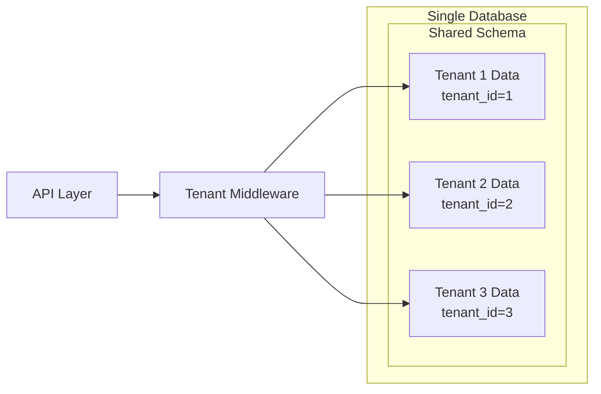
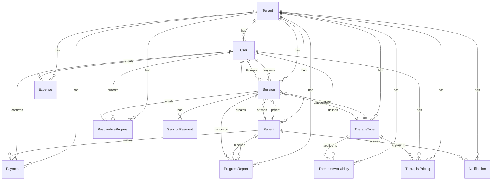
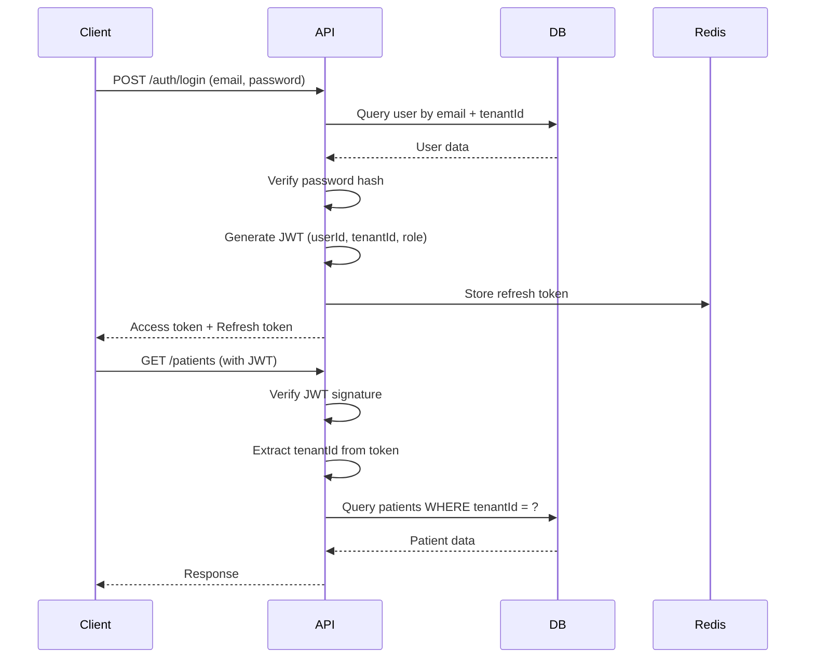

# Design Document

## Overview

This document outlines the technical design for a multi-tenant therapy center management platform. The system is built using a modern tech stack with Node.js backend, PostgreSQL database, and React/Next.js frontend. The architecture emphasizes modularity, scalability, security, and complete data isolation between tenants.

The platform follows a three-tier architecture with clear separation between presentation (React/Next.js), business logic (Node.js API), and data persistence (PostgreSQL). Authentication and authorization are handled through JWT tokens with role-based access control enforced at both API and database levels.

## Architecture

### High-Level Architecture



### Technology Stack

**Backend:**
- Runtime: Node.js (v18+)
- Framework: Express.js (proven, extensive middleware ecosystem)
- ORM: Prisma (type-safe, excellent migration support, multi-tenant patterns)
- Validation: Zod (TypeScript-first schema validation)
- Authentication: jsonwebtoken + bcrypt

**Database:**
- Primary: PostgreSQL 15+ (ACID compliance, JSON support, excellent indexing)
- Caching: Redis (session management, frequently accessed data)

**Frontend:**
- Framework: Next.js 14+ (App Router with Server Components)
- UI Library: React 18+
- Component Library: shadcn/ui (headless, customizable, accessible)
- Styling: TailwindCSS v3+
- State Management: 
  - React Query (TanStack Query v5) for server state
  - Zustand for client state (UI state, filters)
- Forms: React Hook Form + Zod validation
- Tables: TanStack Table v8 (with shadcn/ui data-table)
- Calendar: React Big Calendar (customized with shadcn/ui styling)
- Charts: Recharts (for dashboard analytics)
- Date Handling: date-fns
- Icons: Lucide React (default with shadcn/ui)
- Toast Notifications: sonner (shadcn/ui integration)

**DevOps:**
- Containerization: Docker + Docker Compose
- Deployment: Docker containers (AWS ECS/Fargate ready)
- CI/CD: GitHub Actions
- Monitoring: Winston (logging) + Morgan (HTTP logging)

### Multi-Tenant Architecture Pattern

The system uses a **shared database, shared schema** approach with row-level tenant isolation:



**Key Design Decisions:**
- Every table includes a `tenant_id` column (except system tables like `tenants`)
- Prisma middleware automatically injects tenant filtering on all queries
- JWT tokens include tenant_id claim
- Database-level row-level security (RLS) as additional safety layer

## Components and Interfaces

### Backend API Structure

```
src/
├── config/
│   ├── database.ts          # Prisma client initialization
│   ├── redis.ts             # Redis client configuration
│   └── env.ts               # Environment variable validation
├── middleware/
│   ├── auth.ts              # JWT verification
│   ├── tenant.ts            # Tenant context injection
│   ├── rbac.ts              # Role-based access control
│   ├── validation.ts        # Request validation
│   └── errorHandler.ts      # Global error handling
├── modules/
│   ├── auth/
│   │   ├── auth.controller.ts
│   │   ├── auth.service.ts
│   │   ├── auth.routes.ts
│   │   └── auth.schema.ts
│   ├── users/
│   │   ├── users.controller.ts
│   │   ├── users.service.ts
│   │   ├── users.routes.ts
│   │   └── users.schema.ts
│   ├── patients/
│   ├── therapists/
│   │   ├── therapist-dashboard.controller.ts
│   │   ├── therapist-dashboard.service.ts
│   │   └── therapist-dashboard.routes.ts
│   ├── sessions/
│   ├── payments/
│   │   ├── session-payments.controller.ts
│   │   └── session-payments.service.ts
│   ├── expenses/
│   ├── progress-reports/
│   │   ├── progress-reports.controller.ts
│   │   ├── progress-reports.service.ts
│   │   ├── progress-reports.routes.ts
│   │   └── progress-reports.schema.ts
│   ├── reschedule-requests/
│   │   ├── reschedule-requests.controller.ts
│   │   ├── reschedule-requests.service.ts
│   │   ├── reschedule-requests.routes.ts
│   │   └── reschedule-requests.schema.ts
│   ├── notifications/
│   │   ├── notifications.controller.ts
│   │   ├── notifications.service.ts
│   │   ├── notifications.routes.ts
│   │   └── sms-provider.ts
│   ├── reports/
│   └── tenants/
├── jobs/
│   ├── payment-reminders.job.ts
│   └── scheduler.ts
├── utils/
│   ├── logger.ts
│   ├── jwt.ts
│   └── helpers.ts
├── types/
│   └── express.d.ts         # Extended Express types
├── prisma/
│   ├── schema.prisma
│   ├── migrations/
│   └── seed.ts
└── server.ts
```

### Frontend Application Structure

```
app/
├── (auth)/
│   ├── login/
│   │   └── page.tsx
│   └── layout.tsx
├── (dashboard)/
│   ├── layout.tsx           # Main dashboard layout with sidebar
│   ├── page.tsx             # Dashboard home (role-based redirect)
│   ├── patients/
│   │   ├── page.tsx         # Patient list with data-table
│   │   ├── [id]/
│   │   │   ├── page.tsx     # Patient detail
│   │   │   ├── progress/
│   │   │   │   └── page.tsx # Patient progress reports
│   │   │   └── payments/
│   │   │       └── page.tsx # Patient payment history
│   │   └── new/
│   │       └── page.tsx     # Create patient
│   ├── schedule/
│   │   └── page.tsx         # Calendar view
│   ├── sessions/
│   │   ├── page.tsx         # Session list
│   │   └── [id]/
│   │       └── page.tsx     # Session detail with payment tracking
│   ├── payments/
│   ├── expenses/
│   ├── progress-reports/
│   │   ├── page.tsx         # Progress reports list
│   │   ├── [id]/
│   │   │   └── page.tsx     # View/edit progress report
│   │   └── new/
│   │       └── page.tsx     # Create progress report
│   ├── reschedule-requests/
│   │   ├── page.tsx         # Reschedule requests list (admin view)
│   │   └── [id]/
│   │       └── page.tsx     # Request details and approval
│   ├── reports/
│   ├── notifications/
│   │   └── page.tsx         # Notification logs and settings
│   └── settings/
├── (therapist)/
│   ├── layout.tsx           # Therapist-specific layout
│   ├── dashboard/
│   │   └── page.tsx         # Therapist dashboard
│   ├── schedule/
│   │   └── page.tsx         # Therapist schedule view
│   ├── patients/
│   │   ├── page.tsx         # Therapist's patient list
│   │   └── [id]/
│   │       └── page.tsx     # Patient details and progress
│   ├── sessions/
│   │   └── [id]/
│   │       └── complete/
│   │           └── page.tsx # Complete session and add progress
│   └── reschedule/
│       └── page.tsx         # Request reschedule
├── api/                     # API route handlers (proxy to backend)
├── components/
│   ├── ui/                  # shadcn/ui base components
│   │   ├── button.tsx
│   │   ├── card.tsx
│   │   ├── dialog.tsx
│   │   ├── form.tsx
│   │   ├── input.tsx
│   │   ├── select.tsx
│   │   ├── table.tsx
│   │   ├── calendar.tsx
│   │   ├── badge.tsx
│   │   ├── alert.tsx
│   │   ├── toast.tsx
│   │   └── ...
│   ├── forms/
│   │   ├── patient-form.tsx
│   │   ├── session-form.tsx
│   │   ├── payment-form.tsx
│   │   ├── progress-report-form.tsx
│   │   └── reschedule-request-form.tsx
│   ├── tables/
│   │   ├── patients-table.tsx
│   │   ├── sessions-table.tsx
│   │   ├── payments-table.tsx
│   │   └── data-table.tsx   # Reusable TanStack Table wrapper
│   ├── charts/
│   │   ├── revenue-chart.tsx
│   │   ├── sessions-chart.tsx
│   │   └── utilization-chart.tsx
│   ├── layout/
│   │   ├── sidebar.tsx
│   │   ├── header.tsx
│   │   ├── breadcrumbs.tsx
│   │   └── user-nav.tsx
│   ├── dashboard/
│   │   ├── stats-card.tsx
│   │   ├── recent-sessions.tsx
│   │   └── upcoming-sessions.tsx
│   ├── calendar/
│   │   ├── schedule-calendar.tsx
│   │   ├── session-event.tsx
│   │   └── availability-editor.tsx
│   └── shared/
│       ├── loading-spinner.tsx
│       ├── empty-state.tsx
│       └── error-boundary.tsx
├── lib/
│   ├── api-client.ts        # Axios instance with interceptors
│   ├── auth.ts              # Auth utilities
│   ├── utils.ts             # cn() and other utilities
│   ├── validations.ts       # Zod schemas
│   └── constants.ts         # App constants
├── hooks/
│   ├── use-auth.ts
│   ├── use-patients.ts
│   ├── use-sessions.ts
│   ├── use-payments.ts
│   ├── use-progress-reports.ts
│   ├── use-reschedule-requests.ts
│   └── use-toast.ts
├── types/
│   ├── api.ts
│   ├── models.ts
│   └── index.ts
└── styles/
    └── globals.css
```

## Frontend Implementation Details

### shadcn/ui Setup and Configuration

**Installation:**
```bash
npx shadcn-ui@latest init
```

**Configuration (components.json):**
```json
{
  "$schema": "https://ui.shadcn.com/schema.json",
  "style": "default",
  "rsc": true,
  "tsx": true,
  "tailwind": {
    "config": "tailwind.config.ts",
    "css": "app/globals.css",
    "baseColor": "slate",
    "cssVariables": true
  },
  "aliases": {
    "components": "@/components",
    "utils": "@/lib/utils"
  }
}
```

**Theme Configuration (tailwind.config.ts):**
```typescript
import type { Config } from "tailwindcss"

const config = {
  darkMode: ["class"],
  content: [
    './pages/**/*.{ts,tsx}',
    './components/**/*.{ts,tsx}',
    './app/**/*.{ts,tsx}',
  ],
  theme: {
    extend: {
      colors: {
        border: "hsl(var(--border))",
        input: "hsl(var(--input))",
        ring: "hsl(var(--ring))",
        background: "hsl(var(--background))",
        foreground: "hsl(var(--foreground))",
        primary: {
          DEFAULT: "hsl(var(--primary))",
          foreground: "hsl(var(--primary-foreground))",
        },
        // ... other colors
      },
      borderRadius: {
        lg: "var(--radius)",
        md: "calc(var(--radius) - 2px)",
        sm: "calc(var(--radius) - 4px)",
      },
    },
  },
  plugins: [require("tailwindcss-animate")],
} satisfies Config

export default config
```

### Key Component Implementations

**1. Dashboard Layout with Sidebar:**

```typescript
// components/layout/sidebar.tsx
import { cn } from "@/lib/utils"
import { Button } from "@/components/ui/button"
import { 
  LayoutDashboard, 
  Users, 
  Calendar, 
  CreditCard, 
  FileText,
  Settings 
} from "lucide-react"

const routes = [
  { label: "Dashboard", icon: LayoutDashboard, href: "/dashboard" },
  { label: "Patients", icon: Users, href: "/dashboard/patients" },
  { label: "Schedule", icon: Calendar, href: "/dashboard/schedule" },
  { label: "Payments", icon: CreditCard, href: "/dashboard/payments" },
  { label: "Reports", icon: FileText, href: "/dashboard/reports" },
  { label: "Settings", icon: Settings, href: "/dashboard/settings" },
]

export function Sidebar() {
  return (
    <div className="space-y-4 py-4 flex flex-col h-full bg-slate-900 text-white">
      <div className="px-3 py-2">
        <h2 className="mb-2 px-4 text-lg font-semibold">
          Therapy Center
        </h2>
        <div className="space-y-1">
          {routes.map((route) => (
            <Button
              key={route.href}
              variant="ghost"
              className="w-full justify-start"
              asChild
            >
              <Link href={route.href}>
                <route.icon className="mr-2 h-4 w-4" />
                {route.label}
              </Link>
            </Button>
          ))}
        </div>
      </div>
    </div>
  )
}
```

**2. Data Table with TanStack Table:**

```typescript
// components/tables/patients-table.tsx
"use client"

import { ColumnDef } from "@tanstack/react-table"
import { DataTable } from "@/components/tables/data-table"
import { Button } from "@/components/ui/button"
import { Badge } from "@/components/ui/badge"
import { MoreHorizontal, Eye, Edit } from "lucide-react"
import {
  DropdownMenu,
  DropdownMenuContent,
  DropdownMenuItem,
  DropdownMenuTrigger,
} from "@/components/ui/dropdown-menu"

export const columns: ColumnDef<Patient>[] = [
  {
    accessorKey: "firstName",
    header: "Name",
    cell: ({ row }) => {
      const patient = row.original
      return `${patient.firstName} ${patient.lastName}`
    },
  },
  {
    accessorKey: "guardianName",
    header: "Guardian",
  },
  {
    accessorKey: "guardianPhone",
    header: "Contact",
  },
  {
    accessorKey: "creditBalance",
    header: "Credits",
    cell: ({ row }) => {
      const amount = parseFloat(row.getValue("creditBalance"))
      return `₹${amount.toFixed(2)}`
    },
  },
  {
    accessorKey: "totalOutstandingDues",
    header: "Outstanding",
    cell: ({ row }) => {
      const amount = parseFloat(row.getValue("totalOutstandingDues"))
      return amount > 0 ? (
        <Badge variant="destructive">₹{amount.toFixed(2)}</Badge>
      ) : (
        <Badge variant="secondary">₹0.00</Badge>
      )
    },
  },
  {
    accessorKey: "active",
    header: "Status",
    cell: ({ row }) => {
      const active = row.getValue("active")
      return (
        <Badge variant={active ? "default" : "secondary"}>
          {active ? "Active" : "Inactive"}
        </Badge>
      )
    },
  },
  {
    id: "actions",
    cell: ({ row }) => {
      const patient = row.original
      return (
        <DropdownMenu>
          <DropdownMenuTrigger asChild>
            <Button variant="ghost" className="h-8 w-8 p-0">
              <MoreHorizontal className="h-4 w-4" />
            </Button>
          </DropdownMenuTrigger>
          <DropdownMenuContent align="end">
            <DropdownMenuItem>
              <Eye className="mr-2 h-4 w-4" />
              View Details
            </DropdownMenuItem>
            <DropdownMenuItem>
              <Edit className="mr-2 h-4 w-4" />
              Edit Patient
            </DropdownMenuItem>
          </DropdownMenuContent>
        </DropdownMenu>
      )
    },
  },
]

export function PatientsTable({ data }: { data: Patient[] }) {
  return <DataTable columns={columns} data={data} />
}
```

**3. Form with React Hook Form + Zod:**

```typescript
// components/forms/patient-form.tsx
"use client"

import { zodResolver } from "@hookform/resolvers/zod"
import { useForm } from "react-hook-form"
import * as z from "zod"
import { Button } from "@/components/ui/button"
import {
  Form,
  FormControl,
  FormField,
  FormItem,
  FormLabel,
  FormMessage,
} from "@/components/ui/form"
import { Input } from "@/components/ui/input"
import { Textarea } from "@/components/ui/textarea"

const patientSchema = z.object({
  firstName: z.string().min(2, "First name must be at least 2 characters"),
  lastName: z.string().min(2, "Last name must be at least 2 characters"),
  dateOfBirth: z.string(),
  guardianName: z.string().min(2, "Guardian name is required"),
  guardianPhone: z.string().regex(/^\+?[1-9]\d{9,14}$/, "Invalid phone number"),
  guardianEmail: z.string().email().optional().or(z.literal("")),
  address: z.string().optional(),
  medicalNotes: z.string().optional(),
  creditBalance: z.number().min(0).default(0),
})

type PatientFormValues = z.infer<typeof patientSchema>

export function PatientForm({ 
  defaultValues, 
  onSubmit 
}: { 
  defaultValues?: Partial<PatientFormValues>
  onSubmit: (data: PatientFormValues) => Promise<void>
}) {
  const form = useForm<PatientFormValues>({
    resolver: zodResolver(patientSchema),
    defaultValues,
  })

  return (
    <Form {...form}>
      <form onSubmit={form.handleSubmit(onSubmit)} className="space-y-6">
        <div className="grid grid-cols-2 gap-4">
          <FormField
            control={form.control}
            name="firstName"
            render={({ field }) => (
              <FormItem>
                <FormLabel>First Name</FormLabel>
                <FormControl>
                  <Input placeholder="John" {...field} />
                </FormControl>
                <FormMessage />
              </FormItem>
            )}
          />
          <FormField
            control={form.control}
            name="lastName"
            render={({ field }) => (
              <FormItem>
                <FormLabel>Last Name</FormLabel>
                <FormControl>
                  <Input placeholder="Doe" {...field} />
                </FormControl>
                <FormMessage />
              </FormItem>
            )}
          />
        </div>

        <FormField
          control={form.control}
          name="guardianName"
          render={({ field }) => (
            <FormItem>
              <FormLabel>Guardian Name</FormLabel>
              <FormControl>
                <Input placeholder="Parent/Guardian name" {...field} />
              </FormControl>
              <FormMessage />
            </FormItem>
          )}
        />

        <FormField
          control={form.control}
          name="guardianPhone"
          render={({ field }) => (
            <FormItem>
              <FormLabel>Guardian Phone</FormLabel>
              <FormControl>
                <Input placeholder="+1234567890" {...field} />
              </FormControl>
              <FormMessage />
            </FormItem>
          )}
        />

        <FormField
          control={form.control}
          name="medicalNotes"
          render={({ field }) => (
            <FormItem>
              <FormLabel>Medical Notes</FormLabel>
              <FormControl>
                <Textarea 
                  placeholder="Any relevant medical information..." 
                  {...field} 
                />
              </FormControl>
              <FormMessage />
            </FormItem>
          )}
        />

        <Button type="submit" disabled={form.formState.isSubmitting}>
          {form.formState.isSubmitting ? "Saving..." : "Save Patient"}
        </Button>
      </form>
    </Form>
  )
}
```

**4. Dashboard Stats Cards:**

```typescript
// components/dashboard/stats-card.tsx
import { Card, CardContent, CardHeader, CardTitle } from "@/components/ui/card"
import { LucideIcon } from "lucide-react"

interface StatsCardProps {
  title: string
  value: string | number
  description?: string
  icon: LucideIcon
  trend?: {
    value: number
    isPositive: boolean
  }
}

export function StatsCard({ 
  title, 
  value, 
  description, 
  icon: Icon,
  trend 
}: StatsCardProps) {
  return (
    <Card>
      <CardHeader className="flex flex-row items-center justify-between space-y-0 pb-2">
        <CardTitle className="text-sm font-medium">{title}</CardTitle>
        <Icon className="h-4 w-4 text-muted-foreground" />
      </CardHeader>
      <CardContent>
        <div className="text-2xl font-bold">{value}</div>
        {description && (
          <p className="text-xs text-muted-foreground">{description}</p>
        )}
        {trend && (
          <p className={`text-xs ${trend.isPositive ? 'text-green-600' : 'text-red-600'}`}>
            {trend.isPositive ? '↑' : '↓'} {Math.abs(trend.value)}% from last month
          </p>
        )}
      </CardContent>
    </Card>
  )
}
```

**5. Calendar Component:**

```typescript
// components/calendar/schedule-calendar.tsx
"use client"

import { Calendar, momentLocalizer, Event } from 'react-big-calendar'
import moment from 'moment'
import 'react-big-calendar/lib/css/react-big-calendar.css'
import { Session } from '@/types/models'

const localizer = momentLocalizer(moment)

interface ScheduleCalendarProps {
  sessions: Session[]
  onSelectEvent: (event: Event) => void
  onSelectSlot: (slotInfo: { start: Date; end: Date }) => void
}

export function ScheduleCalendar({ 
  sessions, 
  onSelectEvent, 
  onSelectSlot 
}: ScheduleCalendarProps) {
  const events = sessions.map(session => ({
    id: session.id,
    title: `${session.patient.firstName} - ${session.therapyType.name}`,
    start: new Date(session.scheduledDate),
    end: new Date(session.scheduledDate),
    resource: session,
  }))

  return (
    <div className="h-[600px] bg-white p-4 rounded-lg shadow">
      <Calendar
        localizer={localizer}
        events={events}
        startAccessor="start"
        endAccessor="end"
        onSelectEvent={onSelectEvent}
        onSelectSlot={onSelectSlot}
        selectable
        views={['month', 'week', 'day']}
        defaultView="week"
        eventPropGetter={(event) => ({
          className: 'bg-primary text-primary-foreground rounded px-2 py-1',
        })}
      />
    </div>
  )
}
```

### React Query Setup

**Query Client Configuration:**

```typescript
// lib/query-client.ts
import { QueryClient } from '@tanstack/react-query'

export const queryClient = new QueryClient({
  defaultOptions: {
    queries: {
      staleTime: 60 * 1000, // 1 minute
      cacheTime: 5 * 60 * 1000, // 5 minutes
      refetchOnWindowFocus: false,
      retry: 1,
    },
  },
})
```

**Custom Hooks:**

```typescript
// hooks/use-patients.ts
import { useQuery, useMutation, useQueryClient } from '@tanstack/react-query'
import { apiClient } from '@/lib/api-client'
import { Patient } from '@/types/models'

export function usePatients() {
  return useQuery({
    queryKey: ['patients'],
    queryFn: async () => {
      const { data } = await apiClient.get<Patient[]>('/patients')
      return data
    },
  })
}

export function usePatient(id: string) {
  return useQuery({
    queryKey: ['patients', id],
    queryFn: async () => {
      const { data } = await apiClient.get<Patient>(`/patients/${id}`)
      return data
    },
    enabled: !!id,
  })
}

export function useCreatePatient() {
  const queryClient = useQueryClient()
  
  return useMutation({
    mutationFn: async (patient: Partial<Patient>) => {
      const { data } = await apiClient.post<Patient>('/patients', patient)
      return data
    },
    onSuccess: () => {
      queryClient.invalidateQueries({ queryKey: ['patients'] })
    },
  })
}
```

### Responsive Design Patterns

**Mobile-First Approach:**
- Use Tailwind's responsive prefixes (`sm:`, `md:`, `lg:`, `xl:`)
- Collapsible sidebar on mobile
- Stack cards vertically on small screens
- Simplified tables with horizontal scroll on mobile

**Example:**
```typescript
<div className="grid grid-cols-1 md:grid-cols-2 lg:grid-cols-4 gap-4">
  <StatsCard {...} />
  <StatsCard {...} />
  <StatsCard {...} />
  <StatsCard {...} />
</div>
```

### Accessibility Features

**shadcn/ui Built-in Accessibility:**
- ARIA labels and roles
- Keyboard navigation
- Focus management
- Screen reader support

**Additional Considerations:**
- Semantic HTML
- Alt text for images
- Color contrast ratios (WCAG AA)
- Focus visible states
- Skip navigation links


### API Endpoints

**Authentication:**
- `POST /api/v1/auth/login` - User login
- `POST /api/v1/auth/refresh` - Refresh access token
- `POST /api/v1/auth/logout` - User logout

**Users:**
- `GET /api/v1/users` - List users (admin only)
- `POST /api/v1/users` - Create user (admin only)
- `GET /api/v1/users/:id` - Get user details
- `PUT /api/v1/users/:id` - Update user
- `DELETE /api/v1/users/:id` - Deactivate user (admin only)

**Patients:**
- `GET /api/v1/patients` - List patients (paginated, searchable)
- `POST /api/v1/patients` - Create patient
- `GET /api/v1/patients/:id` - Get patient details
- `PUT /api/v1/patients/:id` - Update patient
- `GET /api/v1/patients/:id/sessions` - Get patient session history
- `GET /api/v1/patients/:id/payments` - Get patient payment history

**Therapy Types:**
- `GET /api/v1/therapy-types` - List therapy types
- `POST /api/v1/therapy-types` - Create therapy type (admin only)
- `PUT /api/v1/therapy-types/:id` - Update therapy type (admin only)
- `DELETE /api/v1/therapy-types/:id` - Delete therapy type (admin only)

**Therapist Availability:**
- `GET /api/v1/therapists/:id/availability` - Get therapist availability
- `POST /api/v1/therapists/:id/availability` - Set availability
- `PUT /api/v1/therapists/:id/availability/:slotId` - Update availability slot
- `DELETE /api/v1/therapists/:id/availability/:slotId` - Remove availability slot

**Therapist Pricing:**
- `GET /api/v1/therapists/:id/pricing` - Get therapist pricing for all therapy types
- `POST /api/v1/therapists/:id/pricing` - Set pricing for therapy type (admin only)
- `PUT /api/v1/therapists/:id/pricing/:pricingId` - Update pricing (admin only)
- `DELETE /api/v1/therapists/:id/pricing/:pricingId` - Remove pricing (admin only)
- `GET /api/v1/therapists/:id/pricing/:therapyTypeId` - Get specific pricing

**Sessions:**
- `GET /api/v1/sessions` - List sessions (filterable by date, therapist, patient)
- `POST /api/v1/sessions` - Create session
- `GET /api/v1/sessions/:id` - Get session details
- `PUT /api/v1/sessions/:id` - Update/reschedule session
- `POST /api/v1/sessions/:id/cancel` - Cancel session
- `GET /api/v1/sessions/calendar` - Get calendar view data

**Payments:**
- `GET /api/v1/payments` - List payments
- `POST /api/v1/payments` - Record payment (admin only)
- `GET /api/v1/payments/:id` - Get payment details
- `GET /api/v1/patients/:id/credits` - Get patient credit balance

**Expenses:**
- `GET /api/v1/expenses` - List expenses
- `POST /api/v1/expenses` - Create expense (admin/accountant)
- `GET /api/v1/expenses/:id` - Get expense details
- `PUT /api/v1/expenses/:id` - Update expense
- `DELETE /api/v1/expenses/:id` - Delete expense

**Reports:**
- `GET /api/v1/reports/dashboard` - Get dashboard KPIs
- `GET /api/v1/reports/financial` - Get financial summary
- `GET /api/v1/reports/sessions` - Get session reports
- `GET /api/v1/reports/export` - Export reports (CSV/PDF)

**Tenants:**
- `POST /api/v1/tenants` - Create tenant (super admin only)
- `GET /api/v1/tenants/:id` - Get tenant details

**Progress Reports:**
- `GET /api/v1/progress-reports` - List progress reports (filterable by patient, therapist, date)
- `POST /api/v1/progress-reports` - Create progress report (therapist)
- `GET /api/v1/progress-reports/:id` - Get progress report details
- `PUT /api/v1/progress-reports/:id` - Update progress report (therapist)
- `GET /api/v1/patients/:id/progress-reports` - Get patient progress history
- `GET /api/v1/progress-reports/:id/export` - Export progress report as PDF

**Reschedule Requests:**
- `GET /api/v1/reschedule-requests` - List reschedule requests (filterable by status, therapist)
- `POST /api/v1/reschedule-requests` - Create reschedule request (therapist, 48hr validation)
- `GET /api/v1/reschedule-requests/:id` - Get request details
- `PUT /api/v1/reschedule-requests/:id/approve` - Approve request (admin/operator)
- `PUT /api/v1/reschedule-requests/:id/reject` - Reject request (admin/operator)
- `DELETE /api/v1/reschedule-requests/:id` - Cancel request (therapist)

**Therapist Dashboard:**
- `GET /api/v1/therapist/dashboard` - Get therapist dashboard data
- `GET /api/v1/therapist/schedule` - Get therapist's schedule (daily/weekly view)
- `GET /api/v1/therapist/patients` - Get therapist's patient list
- `GET /api/v1/therapist/sessions/upcoming` - Get upcoming sessions
- `GET /api/v1/therapist/sessions/today` - Get today's sessions
- `PUT /api/v1/therapist/sessions/:id/complete` - Mark session complete and add notes

**Notifications:**
- `GET /api/v1/notifications` - List notifications (admin only)
- `POST /api/v1/notifications/send` - Send manual notification (admin)
- `GET /api/v1/notifications/:id` - Get notification details
- `GET /api/v1/patients/:id/notifications` - Get patient notification history
- `POST /api/v1/notifications/test` - Test notification configuration

**Session Payments:**
- `GET /api/v1/sessions/:id/payments` - Get session payment details
- `POST /api/v1/sessions/:id/payments` - Record partial payment for session
- `GET /api/v1/patients/:id/outstanding-dues` - Get patient's outstanding dues summary


## Data Models

### Database Schema (Prisma)

The complete Prisma schema defines all entities with proper relationships, indexes, and multi-tenant support:

**Core Models:**
- `Tenant` - Therapy center organization
- `User` - System users with roles (admin, operator, therapist, accountant)
- `TherapyType` - Types of therapy services offered
- `TherapistAvailability` - Weekly availability schedules for therapists
- `Patient` - Patient profiles with guardian information
- `Session` - Therapy session bookings with payment tracking
- `Payment` - Payment transactions and credit purchases
- `SessionPayment` - Tracks partial payments and outstanding dues per session
- `ProgressReport` - Patient progress notes and treatment updates
- `RescheduleRequest` - Therapist schedule change requests
- `Notification` - SMS/Email notification logs
- `Expense` - Operational expenses
- `AuditLog` - System audit trail

**Key Schema Features:**
- All tenant-scoped tables include `tenantId` foreign key
- Composite indexes on `(tenantId, frequently_queried_column)` for performance
- Enums for status fields (UserRole, SessionStatus, PaymentMethod, NotificationStatus, etc.)
- Decimal type for monetary values with precision
- JSON fields for flexible data storage (audit log changes)
- Cascading relationships where appropriate
- Unique constraints to prevent duplicates within tenants
- Support for partial payments with due tracking
- Progress report versioning and history

### Entity Relationship Diagram



**Key Relationships:**
- Each User, Patient, Session, etc. belongs to exactly one Tenant
- Sessions link Patient, Therapist (User), and TherapyType
- SessionPayment tracks partial payments and dues for each session
- Payments are associated with Patients and confirmed by Users
- ProgressReport links Session, Patient, and Therapist for treatment tracking
- RescheduleRequest allows therapists to request schedule changes with approval workflow
- Notification logs all SMS/email communications sent to patients
- TherapistAvailability defines when therapists are available for specific therapy types
- AuditLog tracks all significant actions with user and resource references

**New Schema Additions:**

```prisma
// Therapist pricing configuration
model TherapistPricing {
  id              String   @id @default(cuid())
  tenantId        String
  therapistId     String
  therapyTypeId   String
  sessionDuration Int      // in minutes
  sessionCost     Decimal  @db.Decimal(10, 2)
  active          Boolean  @default(true)
  createdAt       DateTime @default(now())
  updatedAt       DateTime @updatedAt

  tenant      Tenant      @relation(fields: [tenantId], references: [id])
  therapist   User        @relation("TherapistPricing", fields: [therapistId], references: [id])
  therapyType TherapyType @relation(fields: [therapyTypeId], references: [id])

  @@unique([tenantId, therapistId, therapyTypeId])
  @@index([tenantId, therapistId])
  @@index([tenantId, therapyTypeId])
}

// Session payment tracking for partial payments
model SessionPayment {
  id              String   @id @default(cuid())
  tenantId        String
  sessionId       String
  amountPaid      Decimal  @db.Decimal(10, 2)
  amountDue       Decimal  @db.Decimal(10, 2)
  dueDate         DateTime?
  paymentMethod   PaymentMethod
  paidAt          DateTime
  isPaidInFull    Boolean  @default(false)
  createdAt       DateTime @default(now())
  updatedAt       DateTime @updatedAt

  tenant  Tenant  @relation(fields: [tenantId], references: [id])
  session Session @relation(fields: [sessionId], references: [id])

  @@index([tenantId, sessionId])
  @@index([tenantId, isPaidInFull])
  @@index([tenantId, dueDate])
}

// Patient progress reports
model ProgressReport {
  id          String   @id @default(cuid())
  tenantId    String
  patientId   String
  sessionId   String?
  therapistId String
  reportDate  DateTime
  notes       String   @db.Text
  createdAt   DateTime @default(now())
  updatedAt   DateTime @updatedAt

  tenant    Tenant   @relation(fields: [tenantId], references: [id])
  patient   Patient  @relation(fields: [patientId], references: [id])
  session   Session? @relation(fields: [sessionId], references: [id])
  therapist User     @relation("TherapistReports", fields: [therapistId], references: [id])

  @@index([tenantId, patientId])
  @@index([tenantId, therapistId])
  @@index([tenantId, reportDate])
}

// Therapist reschedule requests
enum RescheduleStatus {
  PENDING
  APPROVED
  REJECTED
  CANCELLED
}

model RescheduleRequest {
  id              String           @id @default(cuid())
  tenantId        String
  sessionId       String
  therapistId     String
  requestedDate   DateTime
  requestedTime   String
  reason          String           @db.Text
  status          RescheduleStatus @default(PENDING)
  reviewedBy      String?
  reviewedAt      DateTime?
  reviewNotes     String?
  createdAt       DateTime         @default(now())
  updatedAt       DateTime         @updatedAt

  tenant     Tenant  @relation(fields: [tenantId], references: [id])
  session    Session @relation(fields: [sessionId], references: [id])
  therapist  User    @relation("TherapistRequests", fields: [therapistId], references: [id])
  reviewer   User?   @relation("ReviewerRequests", fields: [reviewedBy], references: [id])

  @@index([tenantId, therapistId])
  @@index([tenantId, status])
  @@index([tenantId, createdAt])
}

// Notification tracking
enum NotificationType {
  SMS
  EMAIL
  PUSH
}

enum NotificationStatus {
  PENDING
  SENT
  FAILED
  RETRYING
}

model Notification {
  id            String             @id @default(cuid())
  tenantId      String
  patientId     String?
  userId        String?
  type          NotificationType
  status        NotificationStatus @default(PENDING)
  subject       String?
  message       String             @db.Text
  recipient     String
  sentAt        DateTime?
  failureReason String?
  retryCount    Int                @default(0)
  metadata      Json?
  createdAt     DateTime           @default(now())
  updatedAt     DateTime           @updatedAt

  tenant  Tenant   @relation(fields: [tenantId], references: [id])
  patient Patient? @relation(fields: [patientId], references: [id])
  user    User?    @relation(fields: [userId], references: [id])

  @@index([tenantId, status])
  @@index([tenantId, patientId])
  @@index([tenantId, createdAt])
  @@index([tenantId, type])
}

// Updated Session model to include payment tracking
model Session {
  id            String        @id @default(cuid())
  tenantId      String
  patientId     String
  therapistId   String
  therapyTypeId String
  scheduledDate DateTime
  startTime     String
  endTime       String
  status        SessionStatus @default(SCHEDULED)
  notes         String?       @db.Text
  cost          Decimal       @db.Decimal(10, 2)
  paidWithCredit Boolean      @default(false)
  cancelReason  String?
  createdAt     DateTime      @default(now())
  updatedAt     DateTime      @updatedAt

  tenant            Tenant              @relation(fields: [tenantId], references: [id])
  patient           Patient             @relation(fields: [patientId], references: [id])
  therapist         User                @relation("TherapistSessions", fields: [therapistId], references: [id])
  therapyType       TherapyType         @relation(fields: [therapyTypeId], references: [id])
  sessionPayments   SessionPayment[]
  progressReports   ProgressReport[]
  rescheduleRequests RescheduleRequest[]

  @@index([tenantId, scheduledDate])
  @@index([tenantId, patientId])
  @@index([tenantId, therapistId])
  @@index([tenantId, status])
}

// Updated Patient model to include notifications
model Patient {
  id                String   @id @default(cuid())
  tenantId          String
  firstName         String
  lastName          String
  dateOfBirth       DateTime
  guardianName      String
  guardianPhone     String
  guardianEmail     String?
  address           String?
  medicalNotes      String?  @db.Text
  creditBalance     Decimal  @default(0) @db.Decimal(10, 2)
  totalOutstandingDues Decimal @default(0) @db.Decimal(10, 2)
  active            Boolean  @default(true)
  createdAt         DateTime @default(now())
  updatedAt         DateTime @updatedAt

  tenant          Tenant           @relation(fields: [tenantId], references: [id])
  sessions        Session[]
  payments        Payment[]
  progressReports ProgressReport[]
  notifications   Notification[]

  @@index([tenantId, active])
  @@index([tenantId, guardianPhone])
  @@index([tenantId, totalOutstandingDues])
}

// Updated User model to include new relationships
model User {
  id           String   @id @default(cuid())
  tenantId     String
  email        String
  passwordHash String
  firstName    String
  lastName     String
  role         UserRole
  active       Boolean  @default(true)
  createdAt    DateTime @default(now())
  updatedAt    DateTime @updatedAt

  tenant                Tenant                  @relation(fields: [tenantId], references: [id])
  sessionsAsTherapist   Session[]               @relation("TherapistSessions")
  therapistAvailability TherapistAvailability[]
  therapistPricing      TherapistPricing[]      @relation("TherapistPricing")
  paymentsConfirmed     Payment[]
  expensesCreated       Expense[]
  progressReports       ProgressReport[]        @relation("TherapistReports")
  rescheduleRequests    RescheduleRequest[]     @relation("TherapistRequests")
  reviewedRequests      RescheduleRequest[]     @relation("ReviewerRequests")
  notifications         Notification[]
  auditLogs             AuditLog[]

  @@unique([tenantId, email])
  @@index([tenantId, role])
  @@index([tenantId, active])
}

// Updated TherapyType model to include pricing relationship
model TherapyType {
  id              String   @id @default(cuid())
  tenantId        String
  name            String
  description     String?
  defaultDuration Int      // in minutes (used if no therapist-specific pricing)
  defaultCost     Decimal  @db.Decimal(10, 2) // used if no therapist-specific pricing
  active          Boolean  @default(true)
  createdAt       DateTime @default(now())
  updatedAt       DateTime @updatedAt

  tenant                Tenant                  @relation(fields: [tenantId], references: [id])
  sessions              Session[]
  therapistAvailability TherapistAvailability[]
  therapistPricing      TherapistPricing[]

  @@unique([tenantId, name])
  @@index([tenantId, active])
}
```

## Security and Authentication

### Authentication Flow



### JWT Token Structure

```typescript
interface JWTPayload {
  userId: string;
  tenantId: string;
  role: UserRole;
  email: string;
  iat: number;
  exp: number;
}
```

**Token Configuration:**
- Access Token: 15 minutes expiry
- Refresh Token: 7 days expiry, stored in Redis
- Algorithm: HS256 (or RS256 for production)

### Role-Based Access Control (RBAC)

**Permission Matrix:**

| Resource | Workspace Admin | Operator | Therapist | Accountant |
|----------|----------------|----------|-----------|------------|
| Users | CRUD | Read | Read (self) | Read |
| Patients | CRUD | CRUD | Read | Read |
| Therapy Types | CRUD | Read | Read | Read |
| Availability | CRUD | CRUD | CRUD (self) | Read |
| Sessions | CRUD | Create, Read, Update | Read (own) | Read |
| Payments | CRUD | Read | Read | CRUD |
| Expenses | CRUD | Read | Read | CRUD |
| Reports | All | Basic | Own stats | Financial |

**RBAC Middleware Implementation:**

```typescript
// Decorator-based approach
@RequireRole([UserRole.WORKSPACE_ADMIN, UserRole.OPERATOR])
@RequirePermission('patients:write')
async createPatient(req: Request, res: Response) {
  // Implementation
}
```

### Tenant Isolation

**Prisma Middleware for Automatic Tenant Filtering:**

```typescript
prisma.$use(async (params, next) => {
  const tenantId = getTenantFromContext();
  
  if (params.model && !SYSTEM_MODELS.includes(params.model)) {
    if (params.action === 'findMany' || params.action === 'findFirst') {
      params.args.where = { ...params.args.where, tenantId };
    }
    if (params.action === 'create') {
      params.args.data = { ...params.args.data, tenantId };
    }
  }
  
  return next(params);
});
```

**Row-Level Security (PostgreSQL):**

```sql
-- Enable RLS on all tenant-scoped tables
ALTER TABLE users ENABLE ROW LEVEL SECURITY;
ALTER TABLE patients ENABLE ROW LEVEL SECURITY;

-- Create policy for tenant isolation
CREATE POLICY tenant_isolation ON users
  USING (tenant_id = current_setting('app.current_tenant_id')::text);
```


## Error Handling

### Error Response Format

```typescript
interface ErrorResponse {
  success: false;
  error: {
    code: string;
    message: string;
    details?: any;
    timestamp: string;
    path: string;
  };
}
```

### Error Categories

**Client Errors (4xx):**
- `400 BAD_REQUEST` - Invalid input data
- `401 UNAUTHORIZED` - Missing or invalid authentication
- `403 FORBIDDEN` - Insufficient permissions
- `404 NOT_FOUND` - Resource not found
- `409 CONFLICT` - Resource conflict (e.g., duplicate email)
- `422 VALIDATION_ERROR` - Schema validation failed

**Server Errors (5xx):**
- `500 INTERNAL_SERVER_ERROR` - Unexpected server error
- `503 SERVICE_UNAVAILABLE` - Database or external service unavailable

### Global Error Handler

```typescript
app.use((err: Error, req: Request, res: Response, next: NextFunction) => {
  logger.error('Error occurred', {
    error: err.message,
    stack: err.stack,
    path: req.path,
    method: req.method,
    tenantId: req.tenantId,
    userId: req.userId
  });

  if (err instanceof ValidationError) {
    return res.status(422).json({
      success: false,
      error: {
        code: 'VALIDATION_ERROR',
        message: err.message,
        details: err.details,
        timestamp: new Date().toISOString(),
        path: req.path
      }
    });
  }

  // Handle other error types...
  
  res.status(500).json({
    success: false,
    error: {
      code: 'INTERNAL_SERVER_ERROR',
      message: 'An unexpected error occurred',
      timestamp: new Date().toISOString(),
      path: req.path
    }
  });
});
```

## Testing Strategy

### Testing Pyramid

```
        /\
       /  \
      / E2E \
     /--------\
    /Integration\
   /--------------\
  /   Unit Tests   \
 /------------------\
```

### Unit Tests

**Coverage Target: 80%+**

**Tools:**
- Jest (test runner)
- Supertest (API testing)
- Prism (Prisma mocking)

**Focus Areas:**
- Service layer business logic
- Utility functions
- Validation schemas
- Middleware functions

**Example:**

```typescript
describe('PatientService', () => {
  describe('createPatient', () => {
    it('should create patient with valid data', async () => {
      const patientData = {
        firstName: 'John',
        lastName: 'Doe',
        // ...
      };
      
      const result = await patientService.create(patientData, tenantId);
      
      expect(result).toHaveProperty('id');
      expect(result.firstName).toBe('John');
    });

    it('should enforce tenant isolation', async () => {
      const patient = await patientService.create(data, 'tenant1');
      
      await expect(
        patientService.findById(patient.id, 'tenant2')
      ).rejects.toThrow('Not found');
    });
  });
});
```

### Integration Tests

**Focus Areas:**
- API endpoint workflows
- Database interactions
- Authentication flows
- Multi-tenant isolation

**Example:**

```typescript
describe('POST /api/v1/sessions', () => {
  it('should create session and deduct credits', async () => {
    const patient = await createTestPatient({ creditBalance: 100 });
    const therapist = await createTestTherapist();
    
    const response = await request(app)
      .post('/api/v1/sessions')
      .set('Authorization', `Bearer ${adminToken}`)
      .send({
        patientId: patient.id,
        therapistId: therapist.id,
        // ...
      });
    
    expect(response.status).toBe(201);
    
    const updatedPatient = await getPatient(patient.id);
    expect(updatedPatient.creditBalance).toBe(50);
  });
});
```

### End-to-End Tests

**Tools:**
- Playwright or Cypress

**Focus Areas:**
- Critical user journeys
- Multi-step workflows
- Cross-module interactions

**Key Scenarios:**
1. Admin creates patient → schedules session → records payment
2. Operator views calendar → reschedules session → verifies audit log
3. Therapist views own schedule → marks session complete
4. Accountant records expense → generates financial report

### Performance Testing

**Tools:**
- Artillery or k6

**Metrics:**
- Response time: p95 < 200ms
- Throughput: 100 req/s per instance
- Database query time: < 50ms average

## Performance Optimization

### Database Optimization

**Indexing Strategy:**
- Composite indexes on `(tenant_id, frequently_queried_column)`
- Index on foreign keys
- Partial indexes for filtered queries (e.g., `WHERE active = true`)

**Query Optimization:**
- Use `select` to limit returned fields
- Implement pagination for list endpoints
- Use database views for complex reports
- Connection pooling (max 20 connections per instance)

### Caching Strategy

**Redis Caching:**
- User sessions (15 min TTL)
- Therapy types (1 hour TTL, invalidate on update)
- Dashboard KPIs (5 min TTL)
- Therapist availability (30 min TTL)

**Cache Invalidation:**
- Time-based expiration
- Event-based invalidation on updates
- Cache-aside pattern

### API Optimization

**Response Optimization:**
- Compression (gzip/brotli)
- Pagination (default 20, max 100 items)
- Field filtering (`?fields=id,name,email`)
- ETags for conditional requests

**Rate Limiting:**
- 100 requests per minute per user
- 1000 requests per minute per tenant
- Stricter limits on expensive operations (reports, exports)

## Notification System

### SMS Provider Integration

**Provider Options:**
- Twilio (recommended for reliability)
- AWS SNS (cost-effective for high volume)
- MSG91 (India-specific, good pricing)

**Implementation:**

```typescript
// SMS Provider Interface
interface SMSProvider {
  sendSMS(to: string, message: string): Promise<SMSResult>;
  getDeliveryStatus(messageId: string): Promise<DeliveryStatus>;
}

// Twilio Implementation
class TwilioProvider implements SMSProvider {
  async sendSMS(to: string, message: string): Promise<SMSResult> {
    const result = await twilioClient.messages.create({
      body: message,
      to: to,
      from: process.env.TWILIO_PHONE_NUMBER
    });
    
    return {
      messageId: result.sid,
      status: 'sent',
      timestamp: new Date()
    };
  }
}
```

### Scheduled Jobs

**Payment Reminder Job:**

```typescript
// Runs daily at 9 AM
cron.schedule('0 9 * * *', async () => {
  const today = new Date();
  
  // Check if today is the 15th
  if (today.getDate() === 15) {
    await sendPaymentReminders();
  }
});

async function sendPaymentReminders() {
  // Get all patients with outstanding dues
  const patientsWithDues = await prisma.patient.findMany({
    where: {
      totalOutstandingDues: { gt: 0 }
    },
    include: {
      sessions: {
        where: {
          sessionPayments: {
            some: {
              isPaidInFull: false
            }
          }
        }
      }
    }
  });

  for (const patient of patientsWithDues) {
    const message = `Dear ${patient.guardianName}, this is a reminder that ${patient.firstName} has an outstanding balance of ₹${patient.totalOutstandingDues}. Please contact us to settle the payment. Thank you!`;
    
    await notificationService.sendSMS({
      tenantId: patient.tenantId,
      patientId: patient.id,
      recipient: patient.guardianPhone,
      message: message,
      type: 'SMS'
    });
  }
}
```

**Notification Retry Logic:**

```typescript
// Runs every hour to retry failed notifications
cron.schedule('0 * * * *', async () => {
  const failedNotifications = await prisma.notification.findMany({
    where: {
      status: 'FAILED',
      retryCount: { lt: 3 }
    }
  });

  for (const notification of failedNotifications) {
    try {
      await smsProvider.sendSMS(notification.recipient, notification.message);
      
      await prisma.notification.update({
        where: { id: notification.id },
        data: {
          status: 'SENT',
          sentAt: new Date()
        }
      });
    } catch (error) {
      await prisma.notification.update({
        where: { id: notification.id },
        data: {
          retryCount: { increment: 1 },
          failureReason: error.message
        }
      });
    }
  }
});
```

### Notification Configuration

**Environment Variables:**
```env
# SMS Provider
SMS_PROVIDER=twilio
TWILIO_ACCOUNT_SID=xxx
TWILIO_AUTH_TOKEN=xxx
TWILIO_PHONE_NUMBER=+1234567890

# Notification Settings
PAYMENT_REMINDER_DAY=15
PAYMENT_REMINDER_ENABLED=true
```

**Database Configuration:**

```typescript
// Tenant-specific notification settings
model NotificationSettings {
  id                    String  @id @default(cuid())
  tenantId              String  @unique
  paymentReminderDay    Int     @default(15)
  paymentReminderEnabled Boolean @default(true)
  smsEnabled            Boolean @default(true)
  emailEnabled          Boolean @default(false)
  reminderTemplate      String  @db.Text
  
  tenant Tenant @relation(fields: [tenantId], references: [id])
}
```

## Therapist Dashboard Features

### Dashboard Components

**Today's Schedule Widget:**
- Shows all sessions for the current day
- Color-coded by status (upcoming, in-progress, completed, cancelled)
- Quick actions: Start session, Mark complete, Add notes

**Weekly Overview:**
- Calendar view of the week
- Session count per day
- Highlights conflicts or gaps

**Patient List:**
- Shows all patients assigned to the therapist
- Quick access to patient history and progress reports
- Indicates patients needing progress updates

**Pending Actions:**
- Sessions requiring progress reports
- Reschedule requests pending approval
- Upcoming sessions (next 24 hours)

### Reschedule Request Workflow

**48-Hour Validation:**

```typescript
async function createRescheduleRequest(data: RescheduleRequestInput) {
  const session = await prisma.session.findUnique({
    where: { id: data.sessionId }
  });
  
  const hoursUntilSession = differenceInHours(
    session.scheduledDate,
    new Date()
  );
  
  if (hoursUntilSession < 48) {
    throw new Error(
      'Reschedule requests must be submitted at least 48 hours before the scheduled session'
    );
  }
  
  return prisma.rescheduleRequest.create({
    data: {
      ...data,
      status: 'PENDING'
    }
  });
}
```

**Approval Workflow:**
1. Therapist submits request (48+ hours before session)
2. Admin/Operator receives notification
3. Admin reviews request and checks availability
4. Admin approves/rejects with notes
5. If approved, session is automatically rescheduled
6. Therapist receives notification of decision

### Progress Report Features

**Quick Entry Form:**
- Session auto-populated if accessed from session completion
- Template-based notes (customizable per therapy type)
- Rich text editor for detailed notes
- Attachment support (future enhancement)

**Progress Tracking:**
- Timeline view of all reports for a patient
- Comparison view (before/after)
- Export to PDF for guardian sharing
- Search and filter by date range or therapist

## Deployment Architecture

### Docker Configuration

**docker-compose.yml:**

```yaml
version: '3.8'

services:
  api:
    build: ./backend
    ports:
      - "3000:3000"
    environment:
      DATABASE_URL: postgresql://user:pass@db:5432/therapy_platform
      REDIS_URL: redis://redis:6379
      JWT_SECRET: ${JWT_SECRET}
    depends_on:
      - db
      - redis

  frontend:
    build: ./frontend
    ports:
      - "3001:3000"
    environment:
      NEXT_PUBLIC_API_URL: http://api:3000

  db:
    image: postgres:15-alpine
    volumes:
      - postgres_data:/var/lib/postgresql/data
    environment:
      POSTGRES_DB: therapy_platform
      POSTGRES_USER: user
      POSTGRES_PASSWORD: pass

  redis:
    image: redis:7-alpine
    volumes:
      - redis_data:/data

volumes:
  postgres_data:
  redis_data:
```

### Environment Configuration

**Development:**
- Local Docker Compose
- Hot reload enabled
- Detailed logging
- Seed data available

**Staging:**
- AWS ECS/Fargate
- RDS PostgreSQL
- ElastiCache Redis
- CloudWatch logging

**Production:**
- Multi-AZ deployment
- Auto-scaling (2-10 instances)
- Database read replicas
- CDN for static assets
- Automated backups (daily)

### Monitoring and Logging

**Logging:**
- Structured JSON logs
- Log levels: ERROR, WARN, INFO, DEBUG
- Correlation IDs for request tracing
- Tenant ID in all logs

**Metrics:**
- API response times
- Database query performance
- Error rates
- Active users per tenant
- Session booking rates

**Alerts:**
- Error rate > 1%
- Response time p95 > 500ms
- Database connection pool exhaustion
- Disk space < 20%

## Future Considerations

### Phase 2 Enhancements

1. **Public Booking Portal**
   - Patient/guardian self-service booking
   - Real-time availability checking
   - Email/SMS notifications

2. **Advanced Reporting**
   - Custom report builder
   - Data visualization dashboards
   - Predictive analytics for scheduling

3. **Mobile Applications**
   - Native iOS/Android apps
   - Therapist mobile check-in
   - Push notifications

4. **Integration Capabilities**
   - Calendar sync (Google Calendar, Outlook)
   - Payment gateway integration (Stripe, PayPal)
   - SMS/Email service integration
   - Electronic health records (EHR) integration

5. **Advanced Features**
   - Video therapy sessions
   - Document management (treatment plans, progress notes)
   - Automated billing and invoicing
   - Insurance claim management

### Scalability Roadmap

- **100 tenants:** Current architecture sufficient
- **1,000 tenants:** Implement database sharding by tenant
- **10,000+ tenants:** Consider separate database per tenant cluster
- **Global expansion:** Multi-region deployment with data residency compliance
